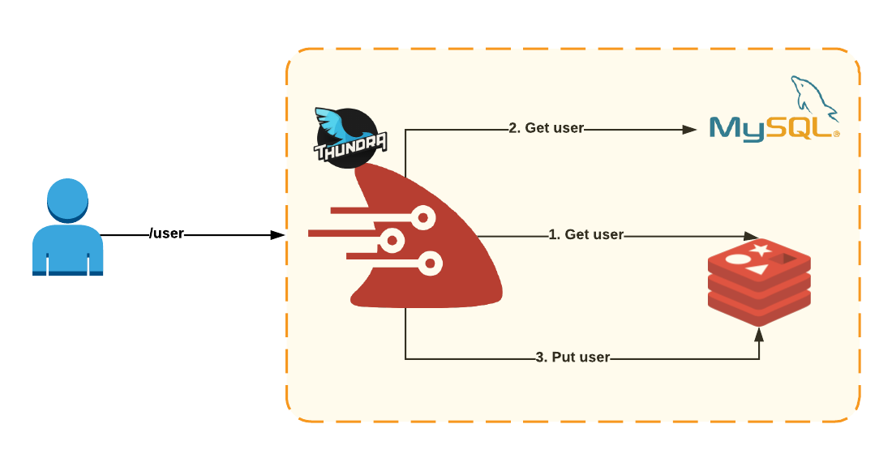
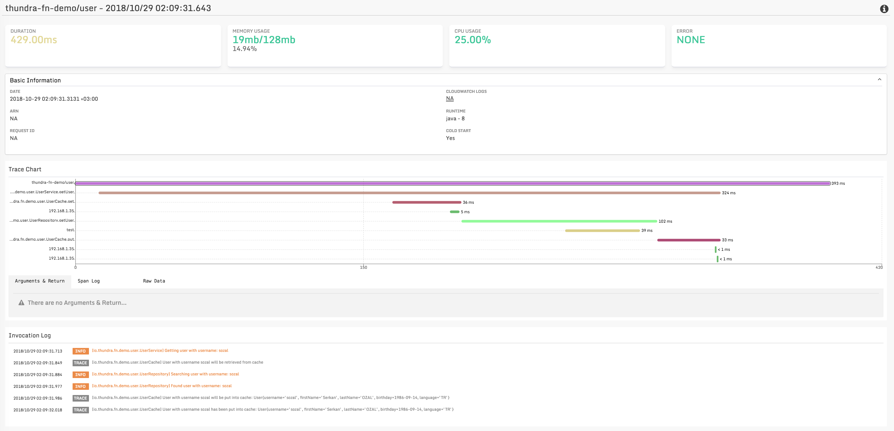
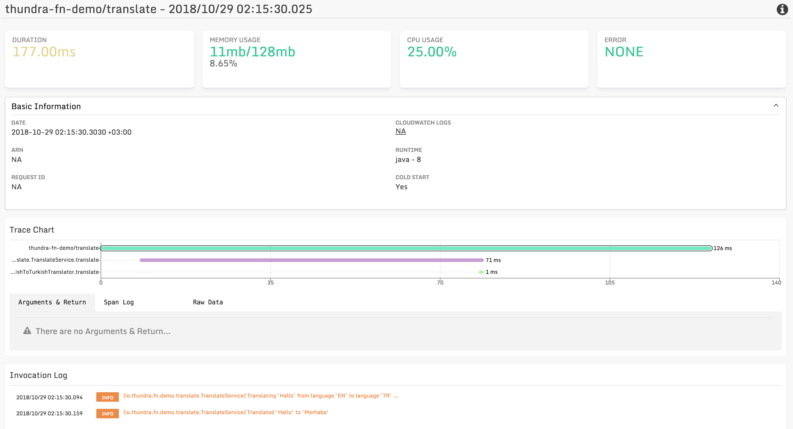
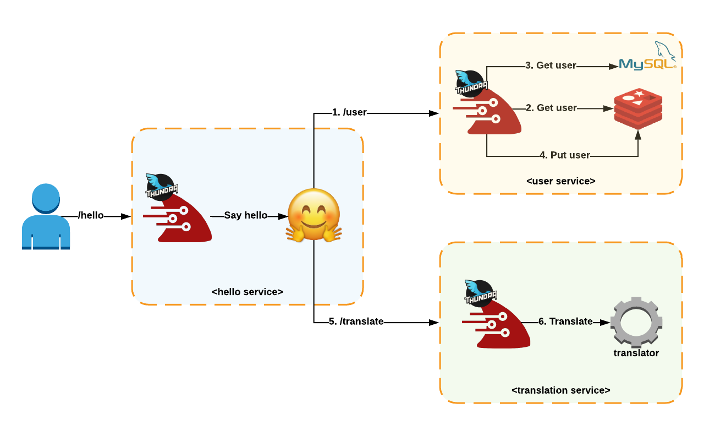
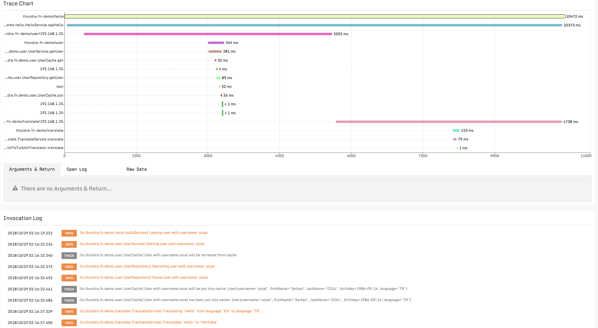
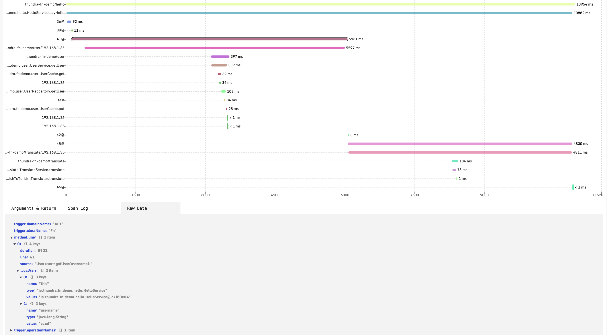

# Thundra Agent FN Project Demo

Thundra Java agent FN project demo.

## Setup

### 1. Setup Redis
* Setup Redis on your local. 
  - On [Mac OS X](https://medium.com/@petehouston/install-and-config-redis-on-mac-os-x-via-homebrew-eb8df9a4f298)
  - On [UNIX](https://www.digitalocean.com/community/tutorials/how-to-install-and-secure-redis-on-ubuntu-18-04)
* Make sure that Redis accepts remote connections (in fact in our demo it only will accept from non-localhost IP 
  on your local machine but from different container). If not enable it by:
  - Open `/etc/redis/redis.conf`
  - Replace `bind 127.0.0.1` with `bind 0.0.0.0`
  - Replace `protected-mode yes` with `protected-mode no`
  - Restart Redis
  
### 2. Setup MySQL  
* Setup MySQL database on your local.
* Create `test` database/schema with the following credentials:
  - username: `test`
  - password: `12345678`
* Run [initialization script](user/db-init.sql) `db-init.sql` under `user/` folder.  

### 3. Configure application properties
* Sign-up and get and API key from [Thundra Console](https://console.thundra.io/)
* Open [properties file](user/src/main/resources/app-config.properties) `app-config.properties` under 
  `user/src/main/resources/` folder and set `thundra.apiKey` property with the API given by Thundra console
* Open [properties file](translate/src/main/resources/app-config.properties) `app-config.properties` under 
  `translate/src/main/resources/` folder and set `thundra.apiKey` property with the API given by Thundra console  
* Open [properties file](hello/src/main/resources/app-config.properties) `app-config.properties` under 
  `hello/src/main/resources/` folder and set `thundra.apiKey` property with the API given by Thundra console  
  
### 4. Deploy applications
* Run FN server by `fn start`
* Deploy applications with [deploy.sh](deploy.sh) script by executing (be sure that it is allowed to execute the script, 
  otherwise give execute access by `chmod 777 deploy.sh` first)  
  
## How to Use

* **Hello service:** Gets username as input and returns found user information as output. Currently there is only one 
  user (whose username is `sozal`) in the database. For additional users, you can insert more users as did in the 
  [initialization script](user/db-init.sql).
  
  You can send sample request by executing [sample-user-request.sh](sample-user-request.sh) script. (be sure that it 
  is allowed to execute the script, otherwise give execute access by `chmod 777 sample-user-request.sh` first)
  Here is a sample result of the script:
  ```
  Getting user with username 'sozal' ...
    % Total    % Received % Xferd  Average Speed   Time    Time     Time  Current
                                   Dload  Upload   Total   Spent    Left  Speed
  100   104  100    99  100     5     27      1  0:00:05  0:00:03  0:00:02    27
  Retrieved user: {"username":"sozal","firstName":"Serkan","lastName":"OZAL","birthday":"1986-09-14","language":"TR"}
  ```
  
  Here is the internal flow of the service:
   
  
  Here is an example trace of the service invocation shown by Thundra console:
   
  
* **Translate service:** Gets text, source and destination languages as input and returns translated text as output. 
  Currently only `Hello` text is able to translated to `Turkish` and `Spanish`. For more translation support, 
  you can modify [TranslateService](translate/src/main/java/io/thundra/fn/demo/translate/TranslateService.java). 
  
  You can send sample request by executing [sample-translate-request.sh](sample-translate-request.sh) script. (be sure 
  that it is allowed to execute the script, otherwise give execute access by `chmod 777 sample-translate-request.sh` 
  first) Here is a sample result of the script:
  ```
  Translating 'Hello' from 'EN' to 'TR' ...
    % Total    % Received % Xferd  Average Speed   Time    Time     Time  Current
                                   Dload  Upload   Total   Spent    Left  Speed
  100    79  100     7  100    72      2     23  0:00:03  0:00:03 --:--:--    23
  Translated to 'Merhaba'
  ``` 
  
  Here is an example trace of the service invocation shown by Thundra console:
   
  
* **Hello service:** Gets username as input and returns hello message according to the associated user's language 
  by appending user's fullname. *Hello service* is an orchestrator service which interacts with both of 
  *User service* (to get user information) and *Translate service* (to translate `Hello` text to user's language).
  Currently there is only one user (whose username is `sozal`) in the database. 
  For additional users, you can insert more users as did in the  [initialization script](user/db-init.sql). 
  
  You can send sample request by executing [sample-hello-request.sh](sample-hello-request.sh) script. (be sure 
  that it is allowed to execute the script, otherwise give execute access by `chmod 777 sample-hello-request.sh` 
  first) Here is a sample result of the script:
  ```
  Saying hello to user with username 'sozal' ...
    % Total    % Received % Xferd  Average Speed   Time    Time     Time  Current
                                   Dload  Upload   Total   Spent    Left  Speed
  100    24  100    19    0     5      1      0  0:00:19  0:00:14  0:00:05     3
  Merhaba Serkan OZAL
  ```   
  
  Here is the internal flow of the service:
   
  
  Here is an example trace of the service invocation shown by Thundra console:
   
  
  To see Thundra Java agent's advanced (and unique) tracing capabilities, you can enable line by line tracing by executing 
  [enable-line-by-line-tracing.sh](enable-line-by-line-tracing.sh) script 
  ([disable-line-by-line-tracing.sh](disable-line-by-line-tracing.sh) to disable). (be sure 
  that it is allowed to execute the script, otherwise give execute access by `chmod 777 enable-line-by-line-tracing.sh` 
  first). This script enables line by line tracing for `sayHello` method in `io.thundra.fn.demo.hello.HelloService`. 
  By line by line tracing enabled, you can see the executions of the each line as a span in our console with the
  local variables states while executing that line and associated source codes.
  
  Here is an example trace of line by line tracing shown by Thundra console:
  
  

